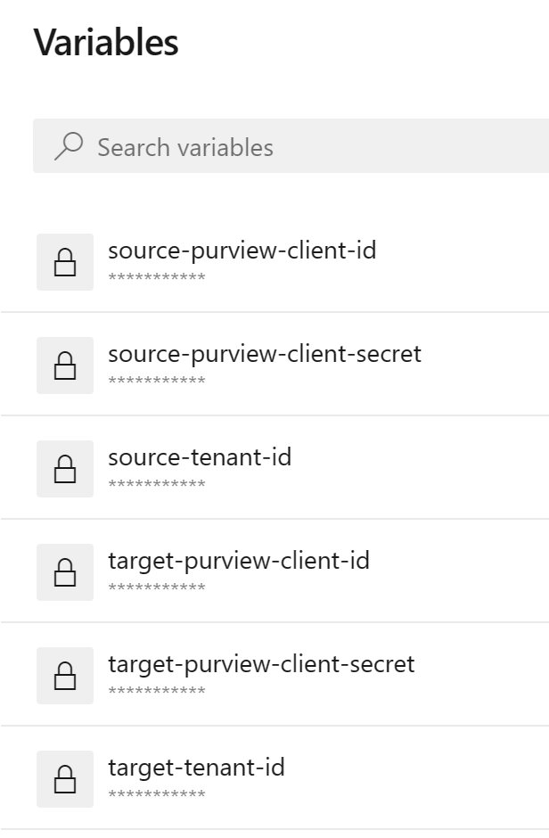

# Azure Purview CI/CD

**Automatically extract all of the collections from a source Purview and deploy them to a target Purview.** 

Examples:
- Create all of the collections from a DEV Purview into a UAT and/or PROD Purview
- Incrementally update your environments. If you create an additional collection in a DEV Purview, deploy it quickly to your upper environments

## Instructions

1. Clone or fork this repository

2. Create an Azure Pipeline using the **collections-azure-pipelines.yml** file. This file is located inside the purview_cicd/pipelines folder

3. Create 6 variables in the Azure Pipeline (checking the **keep this variable secret** to encrypt them if desired and is highly reconmended):
    1. `source-purview-client-id` Client ID of the service principal used for the source Purview. An example is for a DEV Purview
    2. `source-purview-client-secret` Client secret of the service principal used for the Source Purview account
    3. `source-tenant-id` The tenant ID where the source Purview is located in
    4.  `target-purview-client-id`. Client ID of the service principal used for the Target Purview account
    5. `target-purview-client-secret`. Client secret of the service principal used for the Target Purview account
    6. `target-tenant-id` The tenant ID where the target Purview is located in 

Note: If using the same service principal and/or tenant ID for both the source and target Purviews, use the same values in the source and target variables.

For example, your source-purview-client-id and target-purview-client-id variables would have the same value, etc.

How the variables should look in the Azure Pipeline:

4. Assign the Collection Admin Purview role on the root collection to the service principal for each environment:
    - The source service principal needs to be a **Collection Admin** on the root collection on the source Purview account
    - The target service principal needs to be a **Collection Admin** on the root collection on the target Purview account

5. Run the pipeline and pass in the Purview names in the Source Purview Account Name and Target Purview Account Name parameters:
    - Tip: update the collections-azure-pipelines.yml file parameters and add in the Purview names as default values
    - After the pipeline completes, refresh your target Purview account to see all of the new collections!

The pipeline is idempotent. Meaning you can run it several times with the same collections and it won't affect anything.

Hope you enjoy it!

